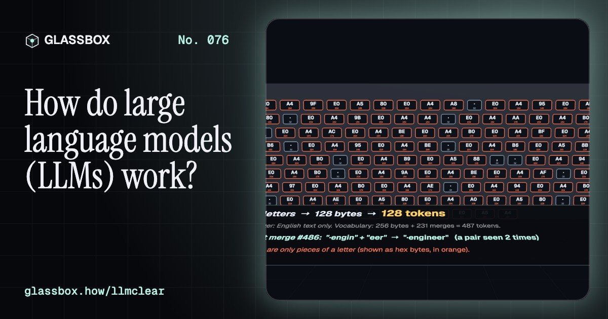
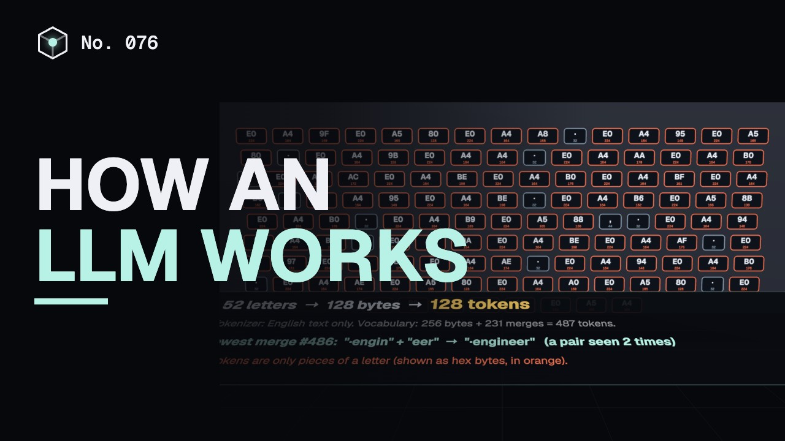
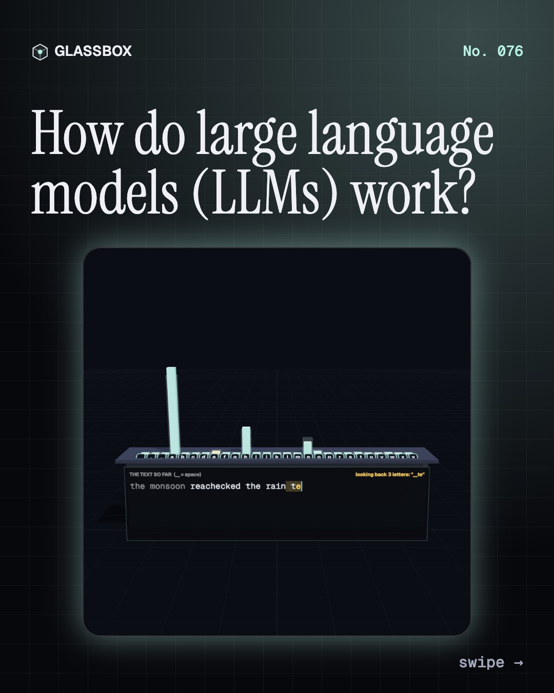
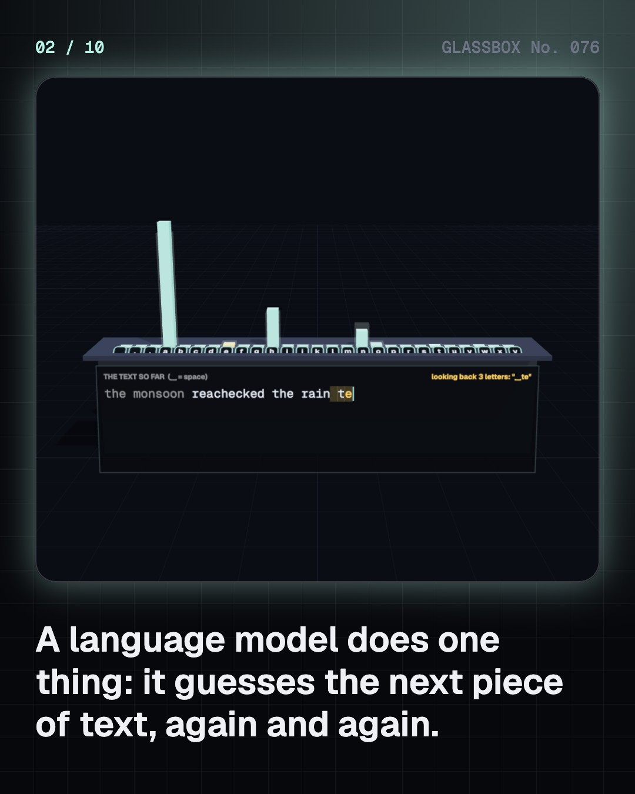
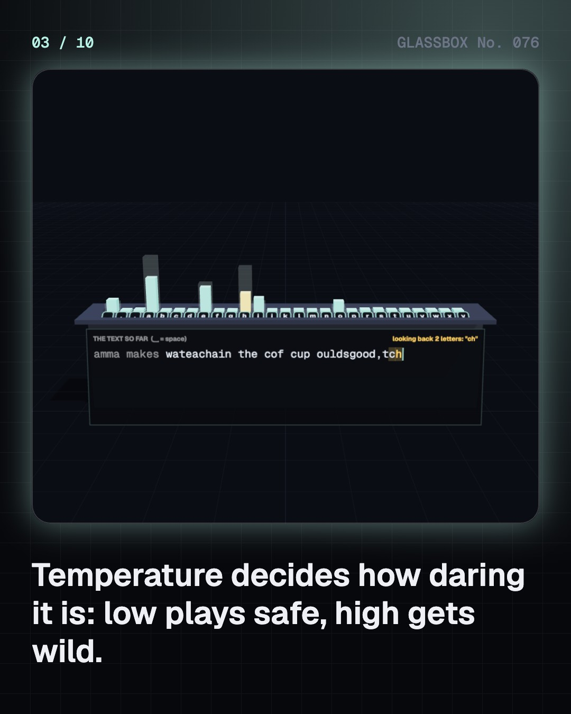
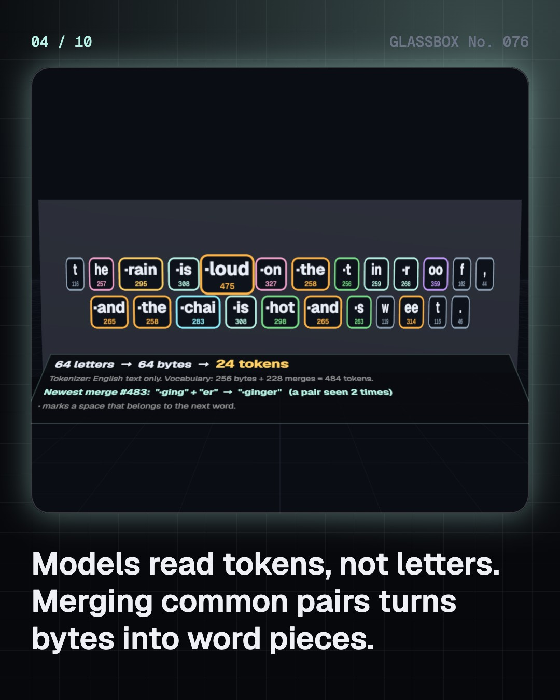

<!-- glassbox:start -->
<!-- Generated from glassbox.json by the Glassbox hub (npm run readme -- llmclear). Edit glassbox.json, not this block. -->
<p align="center"><a href="https://glassbox.how/e/llmclear/"></a></p>

<h1 align="center">LLMClear</h1>

<p align="center"><b>How do large language models (LLMs) work?</b><br>Every chatbot answer is built one guess at a time. Train a real tiny language model on a paragraph about monsoons and chai, watch a tokenizer chop Hindi into bytes, click a word to see what it attends to, and catch the model saying something false with total confidence.</p>

<p align="center"><a href="https://glassbox.how/llmclear/"><b>▶ Play with it</b></a> &nbsp;·&nbsp; <a href="https://glassbox.how/e/llmclear/">Read the 60-second explainer</a> &nbsp;·&nbsp; <a href="https://glassbox.how/llmclear/glassbox/reel.mp4">Watch the 40-second video</a></p>

<p align="center">
  <a href="https://glassbox.how/e/llmclear/"></a>
  <a href="https://glassbox.how/e/llmclear/"></a>
  <a href="LICENSE"></a>
  <a href="LICENSE-CONTENT.md"></a>
  <a href="#privacy"></a>
</p>

## In 60 seconds

1. **A machine that guesses the next word.** A language model gives a probability to every possible next piece of text. Pick one, add it, ask again. Our tiny model learns those odds by counting letters in a 2,100-letter text; temperature and top-k decide how boldly it picks.
2. **Text becomes tokens.** Models read numbered pieces called tokens, built by byte-pair encoding: start from 256 bytes and keep merging the commonest pair. A Devanagari letter is 3 bytes in UTF-8, so a tokenizer trained mostly on English can need several times more tokens for Hindi.
3. **Words become points in space.** Each token is swapped for an embedding, a long list of numbers. Words used in similar company end up close together: chai near coffee, Delhi near Mumbai. The same trick soaks up bias from the text.
4. **Attention: words look at words.** In a transformer, every token makes a query, a key and a value. Queries are matched against keys, softmax turns the scores into shares, and each token takes a mix of the others' values. That is how "it" finds "chai".
5. **Scale, then teaching.** Big models have billions of parameters, trained on trillions of tokens to predict the next one, then tuned on examples and human feedback to be helpful. Compute is about 6 operations per parameter per token, and the energy bill is real.
6. **Fluent is not the same as true.** Because they predict likely text, LLMs can state false things with full confidence, repeat bias and sometimes repeat training text. Give context, ask for sources, check what matters, and keep private data out.

## Words worth knowing

| Term | Meaning |
|---|---|
| **Language model** | A program that gives the probability of each possible next piece of text. |
| **Token** | A numbered piece of text, such as a word, part of a word or a byte, that the model reads. |
| **Byte-pair encoding** | Building a token vocabulary by merging the most frequent neighbouring pair, again and again. |
| **Embedding** | A learned list of numbers that places a token in a space where similar meanings sit close together. |
| **Attention** | Each token scores the others with query-key dot products and takes a weighted mix of their values. |
| **Transformer** | The 2017 architecture that stacks attention and small neural networks; the basis of modern LLMs. |
| **Parameter** | One learned number inside the model; large models have billions. |
| **Temperature** | A sampling dial: low picks the likeliest token, high spreads the choice out. |
| **Hallucination** | A fluent, confident answer that is false or made up. |

## A short history

**From Markov counting letters in a poem in 1913 to chatbots used by hundreds of millions: a century of predicting the next word.**

- **1948** · Fake English from counts (Claude Shannon, Bell Labs, Murray Hill, United States)
- **1966** · ELIZA, the first chatbot (Joseph Weizenbaum, MIT, Cambridge, United States)
- **2013** · word2vec: words as points in space (Tomas Mikolov and colleagues at Google, Mountain View, United States)
- **2014** · Attention: look back at the source (Dzmitry Bahdanau, Kyunghyun Cho and Yoshua Bengio, Université de Montréal, Canada)
- **2017** · "Attention Is All You Need" (Ashish Vaswani and seven co-authors at Google, Mountain View, United States)
- **2019** · GPT-2 writes convincing paragraphs (OpenAI, San Francisco, United States)
- **2020** · GPT-3 and learning from examples in the prompt (Tom Brown and colleagues at OpenAI, San Francisco, United States)
- **2022** · ChatGPT opens to the public (OpenAI, San Francisco, United States)

The full story, with 29 moments, charts, people and 53 sources: [glassbox.how/e/llmclear/history](https://glassbox.how/e/llmclear/history/). The data lives in [`history.json`](history.json).

## Video and slides

Made with the Glassbox studio from this box's storyboard (`window.glassbox.director`). Free to reuse under CC BY 4.0.

<a href="https://glassbox.how/llmclear/glassbox/video.mp4"></a>

<p><a href="glassbox/slide-1.jpg"></a> <a href="glassbox/slide-2.jpg"></a> <a href="glassbox/slide-3.jpg"></a> <a href="glassbox/slide-4.jpg"></a></p>

| File | What | Size |
|---|---|---|
| [`glassbox/reel.mp4`](https://glassbox.how/llmclear/glassbox/reel.mp4) | Reel / Short, with captions and soundtrack | 1080×1920 |
| [`glassbox/video.mp4`](https://glassbox.how/llmclear/glassbox/video.mp4) | YouTube video, with captions and soundtrack | 1920×1080 |
| `glassbox/slide-1…10.jpg` | Instagram carousel | 1080×1350 |
| `glassbox/thumb.jpg` | YouTube thumbnail | 1280×720 |
| `glassbox/cover.jpg` | Share card and repo social preview | 1200×630 |
| [`glassbox/history-reel.mp4`](https://glassbox.how/llmclear/glassbox/history-reel.mp4) | “History in 10 moments” Reel / Short | 1080×1920 |
| `glassbox/history-slide-*.jpg` | History carousel | 1080×1350 |
| `glassbox/post.json` | Post copy and schedule used by the publish kit | |

## Privacy

This box has no accounts and no ads, and it ships its own fonts and libraries. When you run it yourself it sends nothing anywhere. On glassbox.how, the site's `/bar.js` also loads Glassbox's analytics: **Google Analytics** to count visits (it asks first in the EU, UK and Switzerland, and stays off when your browser sends Global Privacy Control or Do Not Track) and **ClickTrust** to detect bots.

It remembers a few things **in your own browser only**, and never sends them anywhere:

| Browser storage key | What it holds |
|---|---|
| `llmclear.v1` | Which chapters you have opened, your best quiz scores, and sound on or off. |

Exactly what each one sees is at [glassbox.how/privacy](https://glassbox.how/privacy/).

## Licences

- **Code:** [MIT](LICENSE). Use it, change it, ship it.
- **Explanations, text, images and videos** (`glassbox.json`, `glassbox/`): [CC BY 4.0](LICENSE-CONTENT.md). Credit “Glassbox, glassbox.how/e/llmclear”.
- **Third-party parts** keep their own licences: [three.js](https://threejs.org) (MIT), [Geist, Instrument Serif](https://openfontlicense.org) (SIL OFL 1.1).
- The Glassbox name and logo aren't covered by either licence. See the [terms](https://glassbox.how/terms/).

Found a mistake? [Open an issue](https://github.com/bdeeps/llmclear/issues). Corrections happen in public.
<!-- glassbox:end -->

## Run it

It's plain HTML, CSS and JavaScript. No build step and no dependencies. Run locally, it contacts no other website.

```bash
python3 -m http.server 8000
```

Three.js and the fonts ship in `vendor/` and `fonts/`, so it also works offline.

Then open http://localhost:8000.

## How it's built

| File | What |
|---|---|
| `index.html`, `css/app.css` | The page and its styles |
| `js/app.js`, `js/stage.js`, `js/ui.js`, `js/kit.js` | The shared Glassbox 3D engine: chapters, 3D stage, controls, quiz, video director |
| `js/chapters/*.js` | One file per chapter: the 3D model, controls, text, key terms, quiz and video scenes |
| `js/llm.js` | The tiny real models: the training text, a character n-gram model with temperature and top-k, a byte-level BPE tokenizer, co-occurrence word vectors (PPMI), a word trigram model, toy attention, and drawing helpers |
| `glassbox.json` | Title, question, explainer beats, key terms, browser storage and credits shown on glassbox.how |
| `reel` in each chapter | The storyboard the Glassbox studio records into short videos |
| `glassbox/` | The published video, slides, thumbnail and post copy |
| `fonts/`, `vendor/three/` | Self-hosted Geist and Instrument Serif (SIL OFL 1.1) and three.js (MIT) |
